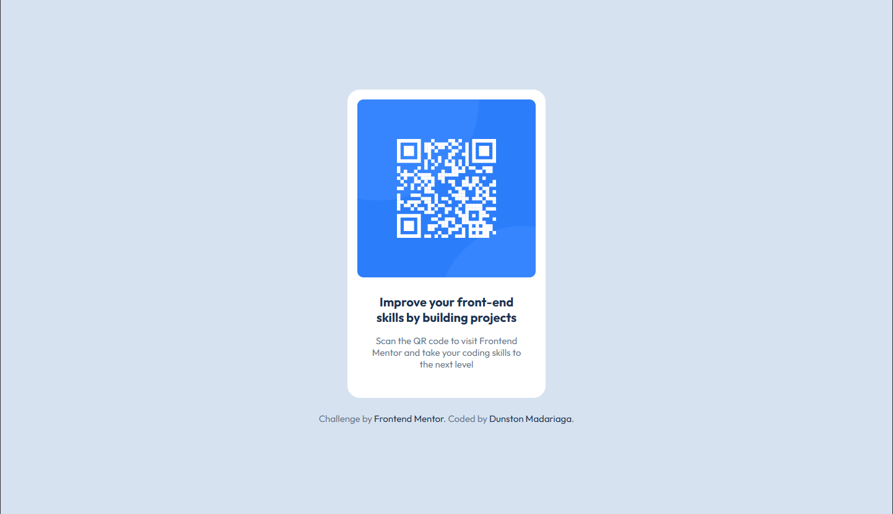

# Frontend Mentor - QR code component solution

This is a solution to the [QR code component challenge on Frontend Mentor](https://www.frontendmentor.io/challenges/qr-code-component-iux_sIO_H). Frontend Mentor challenges help you improve your coding skills by building realistic projects. 

## Table of contents

- [Overview](#overview)
  - [Screenshot](#screenshot)
  - [Links](#links)
- [My process](#my-process)
  - [Built with](#built-with)
  - [What I learned](#what-i-learned)
- [Author](#author)

## Overview

### Screenshot

### Links

- Solution URL: [QR Code](https://frontendmentor-qrcode182028.netlify.app/)

## My process

### Built with

- Semantic HTML5 markup
- CSS custom properties
- Flexbox

### What I learned

I am resuming my study of web programming so there are probably better ways to do what I did in this challenge, I still feel I did well.

## Author

- GitHub - [Pogo182028](https://github.com/Pogo182028)
- Frontend Mentor - [@yourusername](https://www.frontendmentor.io/profile/yourusername)